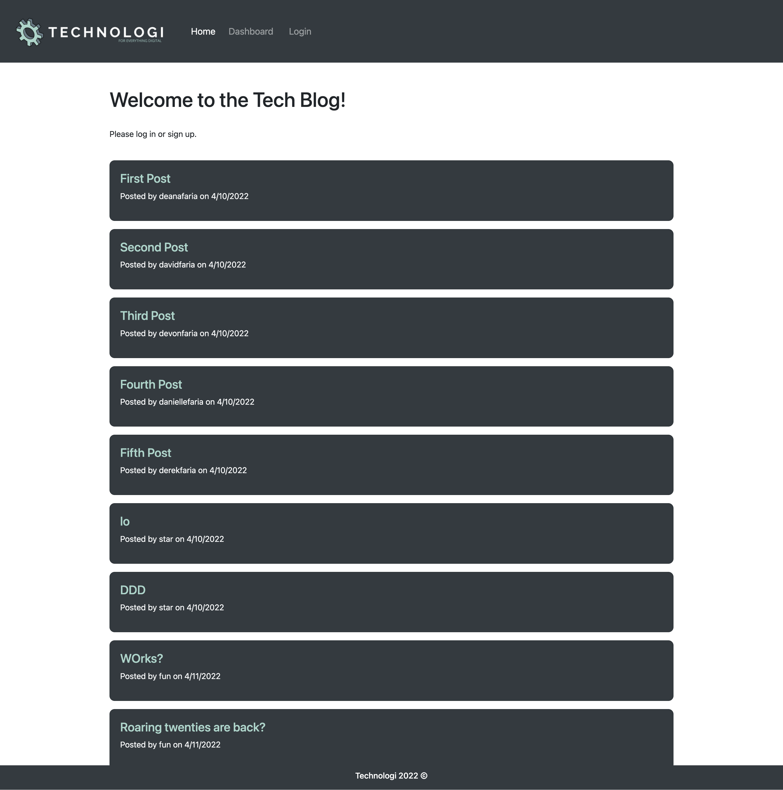
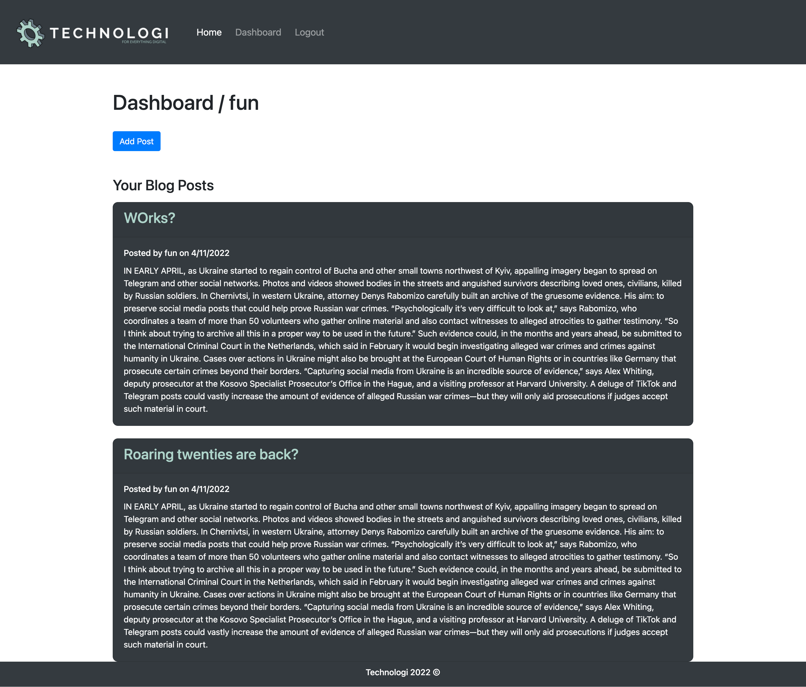
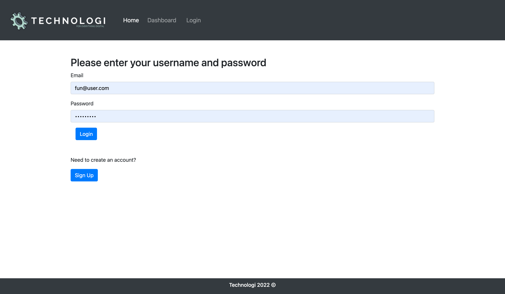
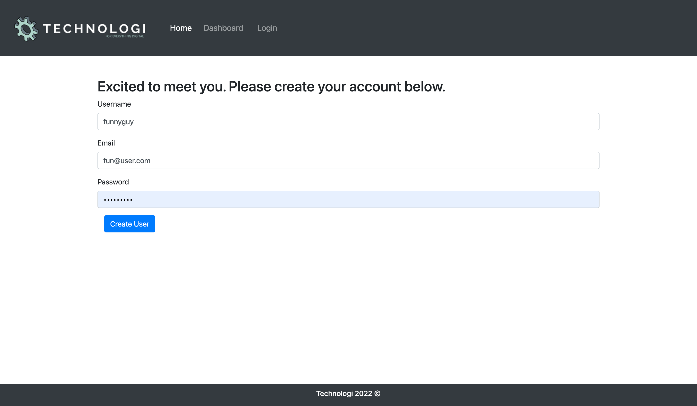
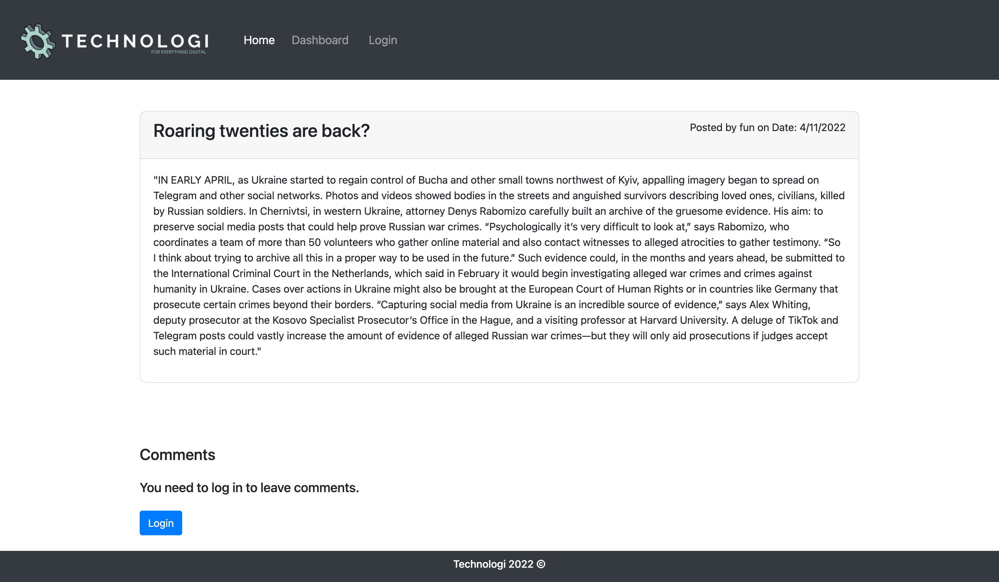
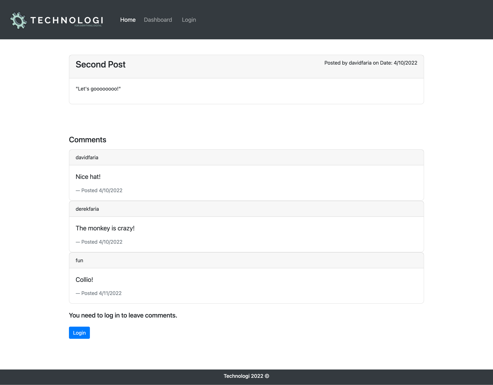

# Tech Blog

[Link to deployed application]()

## Table of Contents

* [Description](#description)
* [Visuals](#visuals)
* [Installation](#installation)
* [Technologies](#technologies)
* [Licenses](#licenses)
* [Support](#support)
* [Authors](#authors)
* [Contributions](#contributions)

## Description

Welcome to the Tech Blog Template. This application uses online servers to host a blogging site, where users can create, update, and delete blog posts, write comments on any blog posts, and manage their activity from their dashboard. 

This application requires users to log in, and immediately encrypts their password before storing it in the database. Set-up is user-friendly, and the UI is easy-to-navigate!

## Visuals

The following image is the homepage of the website .

User Dashboard

Log-In Screen

Sign-up Page

Single Post

Comments section

## Installation

To enjoy this application, you will need to install Node JS on your local computer. [Click here for links to download Node JS.](https://nodejs.org/en/download/)

Then, clone this repository to your local computer, and open up the folder in your coding software (i.e. Visual Studio Code). Once open, open up your Terminal (on Mac OS) or GitBash (on Windows OS). You will have to direct yourself to the cloned repository, and then run this command in the terminal: 

`npm install`

This will download the node modules MySQL2, Express, Nodemon, Sequelize, and DOTENV that this application needs to run on your local computer. After install, you will run the following command to open a MySQL shell in your terminal: 

`mysql -u root` 

Then you will install the schema.sql file so MySQL can format your database. The semi-colon is necessary.

`SOURCE db/schema.sql;`

You can exit the shell by entering:

`exit`

And then type:

`nodemon`

If the last message in the terminal says "App listening on port 3001!", then you have installed the program correctly. If you ever need to shut down this server application use this command:

`^C`

## Technologies

* Node JS
* MySql2
* Sequelize
* DOTENV
* Express
* Express Handlebars
* BCrypt
* 

## Licenses

This application uses the MIT Software License. [Click here to view full license.](LICENSE)

## Support

Contact me at devonfaria@gmail.com if you need assistance downloading or activating this repository. You can also find me on [GitHub.](https://github.com/devonfaria)

## Authors

Devon Faria

## Contributions

Thanks you to Anthony Cooper for another great week!